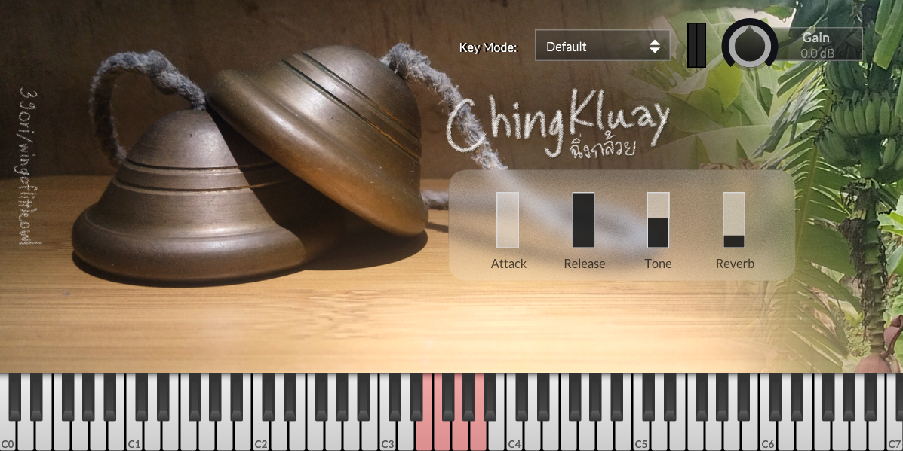

# ChingKluay

A simple Ching, Thai hand-cymbals library. Has 2 sets of sound for open and closed (normal/lightly muted). Also comes with presets for notation in MuseScore 4.

Features:

- Simple user interface
- Comes with two variations for each open and closed sounds (normal and lightly muted sound)
- Lightweight, only has 5 samples for each variation
- Has preset for notation in Musescore 4
- Available as VST3 plugin and Decent Sampler library

## Key mode layout

ChingKluay has 3 key modes

This is note layout in **Default** key mode.

    Open - Note 64 (E4)
    Closed - Note 65 (F4)
    Open (lightly muted) - Note 67 (G4)
    Closed (lightly muted) - Note 69 (A4)

This is note layout in **MS4 Woodblock** key mode.

    Open - Note 76 (E5)
    Closed - Note 77 (F5)
    Open (lightly muted) - Note 79 (G5)
    Closed (lightly muted) - Note 81 (A5)

This is note layout in **MS4 Triangle** key mode.

    Open - Note 81 (A5)
    Closed - Note 80 (G#5)
    Open (lightly muted) - Note 83 (B5)
    Closed (lightly muted) - Note 82 (A#5)

## Using on MuseScore 4

ChingKluay has keymap preset for MuseScore 4 Wood Blocks and Triangle.

You can follow these step to setup ChingKluay on your score.

1. Add wood block or triangle to your score
2. Open mixer and find your track
3. Change "Sound" to ChingKluay
4. In ChingKluay interface, change key mode
   - Choose "MS4 Woodblock" if you use woodblock
   - Choose "MS4 Triangle" if you use triangle

### Wood Blocks default key

    Open - E5 (76)
    Muted - F5 (77)

### Triangle default key

    Open - A5 (81)
    Muted - G#5 (80)

ChingKluay will use Open and Closed sound (normal version) by default.

If you wish to use lightly muted version or change note head and/or position on the staff,
use "Customize kit" on Musescore 4 drum tab.

## Decent Sampler version

ChingKluay also available as Decent Sampler library.
You can download from [Pianobook](https://www.pianobook.co.uk/packs/chingkluay/).

## License

ChingKluay consists of two components

1. The VST plugin software
2. Audio samples.

The software and its source code are licensed under the GNU General Public License (GPLv3.0)
while the samples are licensed under the Creative Commons Attribution 4.0 International (CC-BY 4.0), plus an additional license granting more permissions (CC+).

You can read full GPLv3.0 and CC-By 4.0 & CC+ license on [license page](https://github.com/OwlLibrary/ChingKluay/blob/main/License.txt)

    CC+ License Addendum

    This license grants additional permissions beyond the standard Creative Commons Attribution 4.0 International (CC-BY 4.0) license.
    For the purposes of this license, "ChingKluay samples" refers to any audio files in any format
    included with Ching virtual instruments or Ching sampler libraries created by wingoflittleowl.

    1. Waiver of Attribution for Musical Works
      Permission is granted to the author of any musical work created using ChingKluay samples
      to release that work under any license or terms they choose, without requiring attribution or credit.

    - Examples of what is ALLOWED without attribution:
      - You write a song using ChingKluay samples and release it on Spotify, Apple Music, or YouTube.
        You do not need to credit wingoflittleowl in the description or metadata.

      - You use the instrument to score a film, video game, or commercial.
        You do not need to include wingoflittleowl in the credits.

    - Examples of what does NOT qualify as a musical work:
      - Exporting a single note, chord, or raw sample and uploading it as a track.

      - Rendering an isolated sample with a slight reverb and calling it a finished song.

    2.  Commercial Loops and Phrases
        Permission is explicitly granted for musical loops or phrases created using ChingKluay samples to be distributed commercially,
        either as audio files or as part of a virtual instrument library.
        All standard terms of the base CC-BY 4.0 license (including attribution) still apply to the underlying source samples.

        Examples of what is ALLOWED (with attribution):
        - You create a hip-hop melody loop pack using ChingKluay samples and sell it on your website or Bandcamp.
          (You must include "Includes samples by wingoflittleowl" in the pack's documentation).

        - You program rhythmic phrases into a new DecentSampler or Kontakt library and share or sell it online.
          (You must attribute wingoflittleowl as the original sample provider).

          Examples of what is NOT ALLOWED:

        - Re-packaging the raw, individual ChingKluay sample files into another sample pack without adding original musical content or creative modification.
